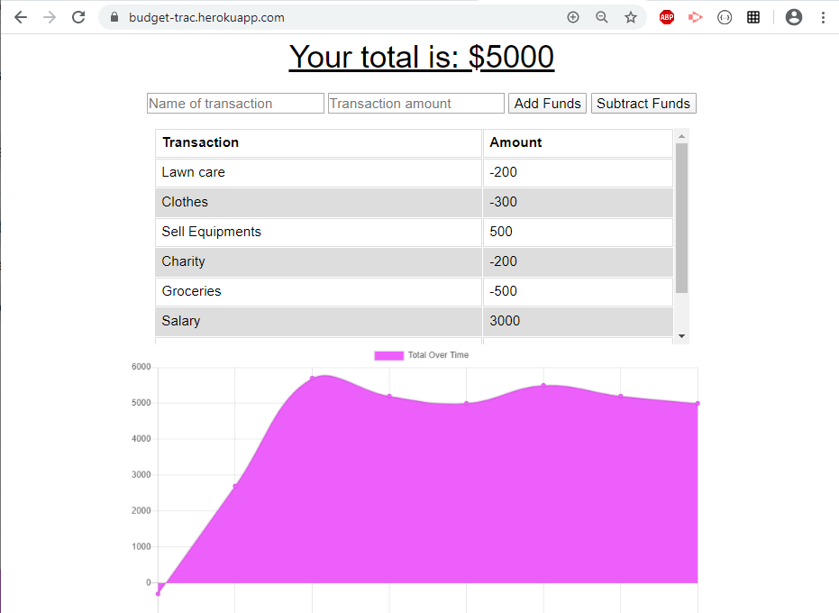

# Budget-Trac


## Table of contents:

-   [ Description ](#description)
-   [ Installation ](#installation)
-   [ Deployed Link ](#deployed)
-   [ Usage ](#usage)
-   [ License ](#license)

## <a name="description"></a>Description:

 Budget tracker app is a fast and easy way to track users money flow by allowing them to access that information anytime(online or offline). Having offline functionality is paramount to our applications success. 
 Budget logger is created with MongoDB, Node, Express, CSS and HTML. This app is a PWA app.

## <a name="installation"></a>Installation:

```bash
    npm init
    npm i compression express
    npm i lite-server morgan mongoose
```
## <a name="deployed"></a>Deployed Link:

https://budget-trac.herokuapp.com/

## <a name="usage"></a>Usage:
```bash
    npm run start 
```


## <a name="contributing"></a>Contributing:
Pull requests are welcome. For major changes, please open an issue first to discuss what you would like to change.Code of Conduct: Standard (Fork, Clone, Commit, Push and Create Pull requests).

## <a name="license"></a>License:
 <i>MIT Copyright (c). All rights reserved.</i>

